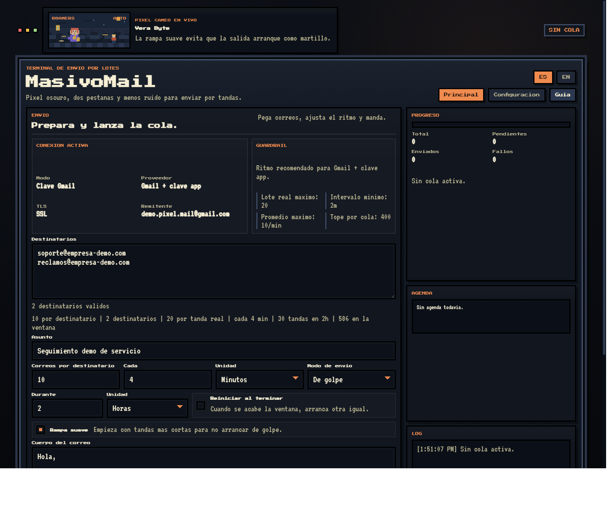
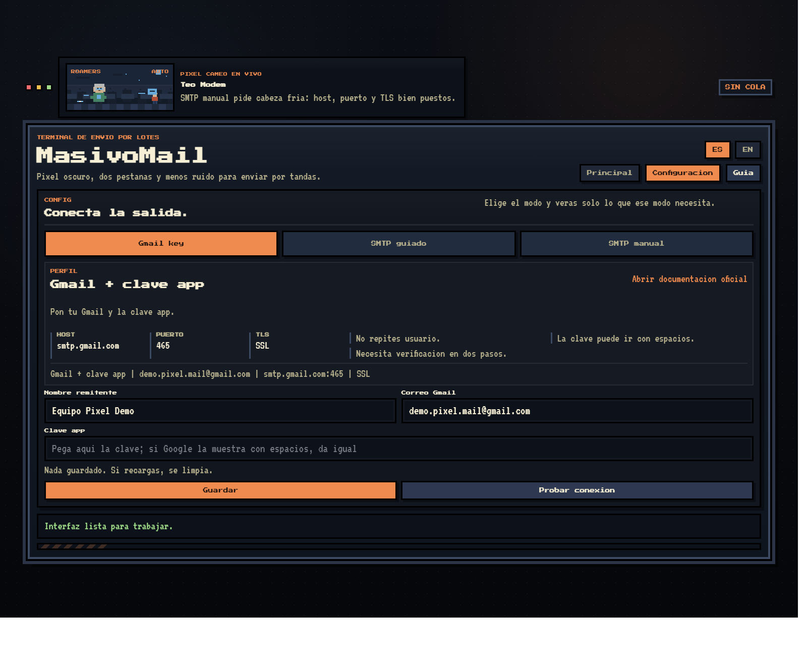

# MasivoMail

<p align="center">
  <strong>Terminal pixel-retro en Docker para enviar correos por tandas desde tu propio Gmail o SMTP.</strong>
</p>

<p align="center">
  
  
  
  
</p>

<p align="center">
  Sin SaaS, sin panel externo, sin configuraciones rebuscadas: escribes, marcas el ritmo y lanzas la cola.
</p>



## Por que existe

MasivoMail nacio de una idea simple: hay veces en las que un solo correo no basta, pero tampoco quieres abrir una plataforma pesada ni depender de un servicio externo para insistir.

La app corre localmente, se conecta a tu propia salida y te deja controlar tandas, tiempos, ventanas y reinicios desde una web con estilo retro y una lectura visual clara.

## Lo que trae

- Corre localmente en Docker.
- Soporta `Gmail key`, `SMTP guiado` y `SMTP manual`.
- Permite definir `correos por destinatario`, `cada cuanto`, `modo de envio`, `duracion de ventana` y `reinicio automatico`.
- Si pones `10` y hay `2` destinatarios, la tanda real sera de `20` correos: `10` para cada uno.
- Acepta adjuntos PNG, JPG y PDF.
- Muestra `Progreso`, `Agenda` y `Log` en vivo.
- No guarda formularios ni credenciales al recargar la pagina.
- Incluye selector `ES | EN`, onboarding y UI pixel-art.

## Capturas

Todas las capturas del repo usan datos de prueba.

### Principal


### Configuracion



## Clonar y levantar en una linea

### Windows PowerShell

```powershell
git clone https://github.com/idalbertopeguero-boop/MasivoMail.git; cd MasivoMail; docker compose up -d --build
```

### Linux o macOS

```bash
git clone https://github.com/idalbertopeguero-boop/MasivoMail.git && cd MasivoMail && docker compose up -d --build
```

## Si ya estas dentro del repo

```bash
docker compose up -d --build
```

Luego abre [http://localhost:3000](http://localhost:3000).

Para apagarlo:

```bash
docker compose down
```

## Flujo rapido

1. En `Configuracion`, eliges el tipo de salida y pruebas la conexion.
2. En `Principal`, pegas destinatarios, asunto, cuerpo y adjuntos.
3. Ajustas el ritmo:
   - correos por destinatario
   - intervalo en segundos, minutos u horas
   - envio `De golpe` o `Encolado`
   - cuanto dura la ventana
   - si la ventana reinicia automaticamente
4. Lanzas la cola y revisas `Progreso`, `Agenda` y `Log`.

## Modos de salida

### `Gmail key`

Usa tu Gmail y una clave de aplicacion de Google. La app limpia la clave aunque Google la muestre separada por espacios.

### `SMTP guiado`

Carga presets para proveedores comunes y reduce lo que tienes que escribir. La idea es que pongas lo minimo y salgas rapido.

Proveedores incluidos:

- Gmail
- Outlook.com
- Microsoft 365
- Hostinger

### `SMTP manual`

Te deja controlar `host`, `puerto`, `TLS` y `usuario` cuando tu proveedor no esta en la lista o necesitas una configuracion propia.

## Stack

- Node.js
- Express
- Nodemailer
- Docker
- HTML, CSS y JavaScript vanilla

## Ejecutar sin Docker

```bash
npm install
npm start
```

## Estructura

```text
public/              interfaz retro y logica del frontend
docs/images/         capturas para GitHub
server.js            backend, validaciones y logica de cola
storage/             configuracion local y adjuntos temporales
Dockerfile
docker-compose.yml
```

## Validado con

- `node --check server.js`
- `node --check public/app.js`
- `docker compose up -d --build`

## Uso responsable

MasivoMail envia desde tu propia cuenta y tu propia salida SMTP.

No intenta:

- ocultar identidad
- evadir filtros
- saltarse limites del proveedor
- disfrazarse como una plataforma corporativa

La responsabilidad del uso, del ritmo y de las credenciales sigue siendo tuya.
